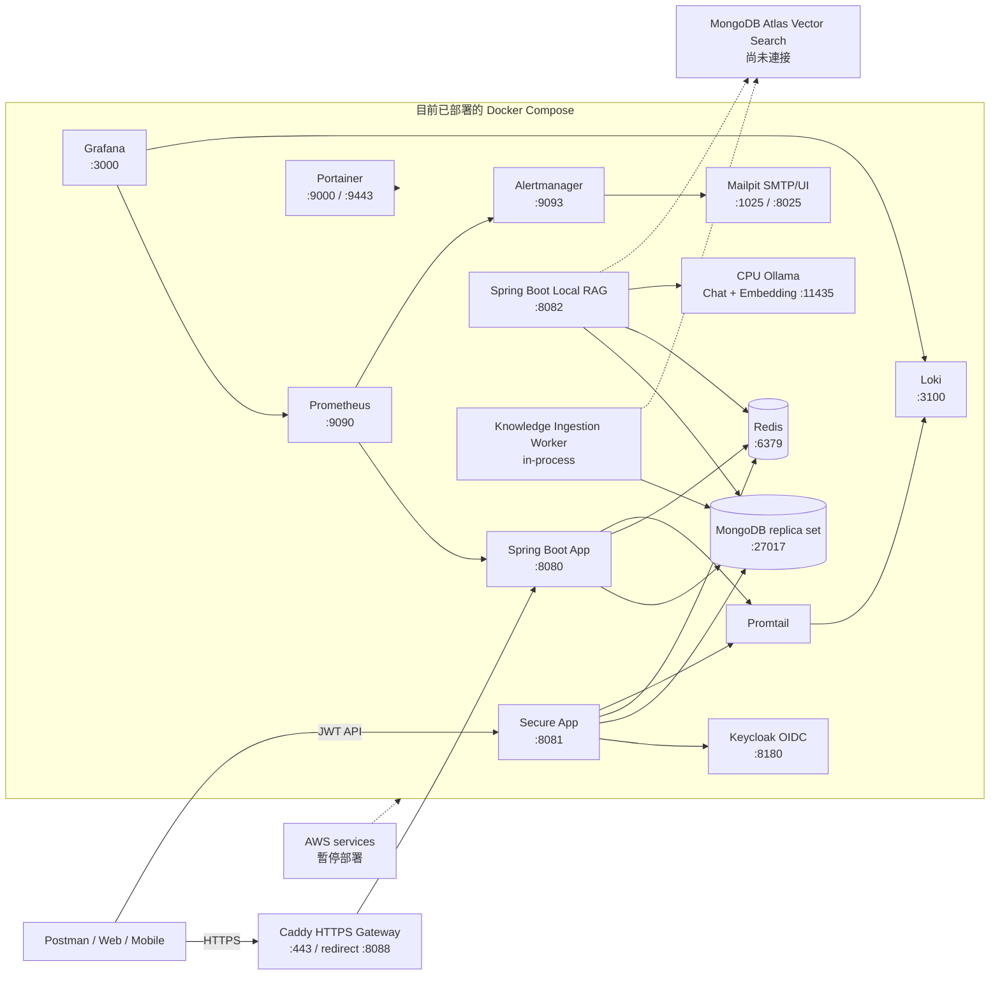
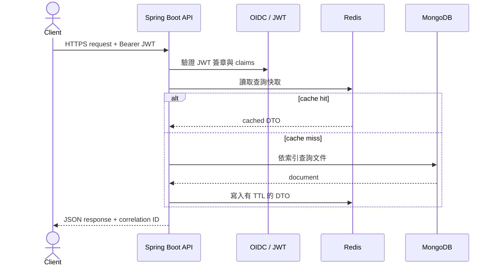

# Java + MongoDB + Spring AI RAG 專案架構設計

## 1. 設計目標

本架構依據原始架構圖重新設計，採用 Java、Spring Boot、MongoDB 與 Spring AI 建立包含 RAG 的應用平台，保留 Redis、Docker、物件儲存與監控能力。

核心原則：

- 先以「模組化單體」交付，依業務模組切分程式碼與資料集合；流量或團隊規模成長後再拆成微服務。
- MongoDB 是唯一主要業務資料庫，不再保留 JDBC、JPA 或 MyBatis。
- MongoDB 儲存長期業務資料；Redis 只儲存可重建的快取、短期狀態、限流計數及分散式鎖。
- 應用服務保持無狀態，可水平擴充；檔案放 S3 相容物件儲存，不寫入應用容器。
- 以明確的聚合邊界、索引、樂觀鎖與冪等機制處理文件資料庫的一致性。
- RAG 使用 MongoDB Atlas Vector Search，檢索前先套用 tenant 與 ACL 過濾，回答必須帶可追溯來源。

## 2. 建議技術基線

| 類別 | 技術選擇 | 用途 |
|---|---|---|
| 語言 | Java 21 LTS | 應用程式語言與長期支援執行環境 |
| 核心框架 | Spring Boot 4.1.0 | Web、組態、依賴注入與生命週期 |
| AI 框架 | Spring AI 2.0.0 | ChatClient、Embedding、VectorStore、RAG Advisor 與評測 |
| API | Spring Web MVC、Jakarta Validation | REST API、輸入驗證 |
| 資料存取 | Spring Data MongoDB | Repository、MongoTemplate、索引與交易 |
| 主要資料庫 | MongoDB Atlas / replica set | 業務文件、交易、Change Streams |
| 向量檢索 | MongoDB Atlas Vector Search | chunk embedding、相似度搜尋與 metadata filter |
| AI 模型 | Spring AI model adapter（OpenAI 為範例） | Chat 與 Embedding；可依環境替換供應商 |
| 快取與短期狀態 | Redis + Spring Data Redis | Cache-aside、限流、短期 Token/Session |
| 安全 | Spring Security、OAuth2 Resource Server、JWT | 身分驗證與 RBAC |
| API 文件 | springdoc-openapi | OpenAPI 規格與 Swagger UI |
| 資料映射 | MapStruct（選配） | Domain、DTO 間的明確映射 |
| 樣板程式 | Lombok（選配） | 僅用於低風險樣板碼，不放寬領域模型封裝 |
| 建置 | Maven Wrapper | 可重現建置 |
| 可觀測性 | Actuator、Micrometer、Prometheus、Grafana | 健康檢查、指標與告警 |
| 日誌 | SLF4J、Logback、JSON encoder | 結構化日誌與集中收集 |
| 測試 | JUnit 5、Mockito、Testcontainers | 單元、整合與真實 MongoDB/Redis 測試 |
| 部署 | Docker Compose（初期）、AWS ECS/EKS（成長期） | 容器化與水平擴充 |

> 本專案固定使用 Spring Boot 4.1.0 與 Spring AI 2.0.0。Spring AI 2.0.x 官方支援 Spring Boot 4.0.x / 4.1.x。Spring 生態依賴由 Spring Boot 與 Spring AI BOM 管理；第三方套件必須支援 Spring Boot 4、Jakarta API 與 Java 21，不個別覆寫受管理版本，除非有已驗證的相容性需求。

## 3. 系統拓樸



### 網路與連接埠

- 對外只開放 `443`；`80` 僅用於導向 HTTPS。
- 應用程式的 `8080` 只對反向代理或負載平衡器開放。
- MongoDB `27017`、Redis `6379` 不對公網開放，只允許私有網路中的應用程式連線。
- 正式環境使用 MongoDB Atlas 或至少三節點 replica set；即使本機只有一個 MongoDB 容器，也應以單節點 replica set 啟動，才能驗證交易與 Change Streams。
- RAG 正式環境使用 MongoDB Atlas Vector Search；AI 模型供應商只允許由後端經 TLS 呼叫，API key 不傳給客戶端。

## 4. 應用程式架構

採用「依業務功能分包，包內分層」的模組化單體，避免所有 Controller、Service、Repository 各自堆在大型全域資料夾。

```text
src/main/java/com/example/platform/
├── PlatformApplication.java
├── shared/
│   ├── config/              # Mongo、Redis、Security、OpenAPI 組態
│   ├── error/               # 統一例外與 Problem Details
│   ├── security/            # CurrentUser、權限檢查、JWT 轉換
│   ├── observability/       # correlationId、metrics、audit hooks
│   └── web/                 # 分頁格式、共用 response 型別
├── identity/
│   ├── api/                 # UserController、request/response DTO
│   ├── application/         # use case、交易與授權協調
│   ├── domain/              # User、Role、領域規則
│   └── infrastructure/      # Mongo repository、外部 IdP adapter
├── catalog/
│   ├── api/
│   ├── application/
│   ├── domain/
│   └── infrastructure/
├── ordering/
│   ├── api/
│   ├── application/
│   ├── domain/
│   └── infrastructure/
├── file/
│   ├── api/
│   ├── application/
│   ├── domain/
│   └── infrastructure/      # S3 adapter、metadata repository
└── knowledge/
    ├── api/                 # KnowledgeController、RagController、SSE response
    ├── application/         # ingest、retrieve、answer、citation use cases
    ├── domain/              # KnowledgeDocument、Chunk、Source、ACL
    └── infrastructure/      # Spring AI、VectorStore、DocumentReader、model adapter
```

### 分層責任

| 層 | 責任 | 不應負責 |
|---|---|---|
| `api` | HTTP 契約、驗證、狀態碼、DTO | 業務規則、直接操作資料庫 |
| `application` | 編排 use case、授權、交易、冪等 | HTTP 細節、Mongo 查詢語法散落 |
| `domain` | 聚合、值物件、狀態轉換與不變量 | Spring Web、Redis、外部服務 |
| `infrastructure` | MongoDB、Redis、S3、Email、IdP adapter | 決定業務流程 |

模組間透過 application service 或發布領域事件互動，不直接讀寫其他模組的 collection。若未來拆成微服務，這個界線可降低搬移成本。

`knowledge` 模組可以讀取已授權的業務資料快照，但不可直接修改 catalog、ordering 等核心聚合。AI 產生的建議若要觸發業務寫入，必須轉成明確命令並再次通過驗證、授權與人工確認策略。

## 5. MongoDB 資料設計

### 5.1 集合與聚合根

以下是通用商務系統的起始模型；實際欄位仍應依業務需求調整。

#### `users`

```json
{
  "_id": "ObjectId",
  "externalSubject": "oidc-provider-user-id",
  "email": "user@example.com",
  "displayName": "User Name",
  "roles": ["USER"],
  "status": "ACTIVE",
  "createdAt": "Instant",
  "updatedAt": "Instant",
  "version": 1
}
```

索引：

- `externalSubject` 唯一索引。
- `email` 使用正規化欄位或適當 collation 的唯一索引。
- 管理後台常用查詢可建立 `{ status: 1, createdAt: -1 }` 複合索引。

#### `products`

```json
{
  "_id": "ObjectId",
  "sku": "SKU-001",
  "name": "Product",
  "description": "...",
  "price": { "amount": "1299.00", "currency": "TWD" },
  "tags": ["tag-a", "tag-b"],
  "status": "ACTIVE",
  "attributes": { "color": "black" },
  "createdAt": "Instant",
  "updatedAt": "Instant",
  "version": 3
}
```

索引：

- `sku` 唯一索引。
- `{ status: 1, updatedAt: -1 }` 支援列表查詢。
- 需要一般全文搜尋時建立 MongoDB text index；需要更完整搜尋能力時使用 Atlas Search，不在應用端以 regex 掃描大量資料。

#### `orders`

```json
{
  "_id": "ObjectId",
  "orderNo": "ORD-20260715-000001",
  "userId": "ObjectId",
  "status": "CREATED",
  "items": [
    {
      "productId": "ObjectId",
      "sku": "SKU-001",
      "nameSnapshot": "Product",
      "unitPrice": { "amount": "1299.00", "currency": "TWD" },
      "quantity": 2
    }
  ],
  "total": { "amount": "2598.00", "currency": "TWD" },
  "shippingAddressSnapshot": { "...": "..." },
  "createdAt": "Instant",
  "updatedAt": "Instant",
  "version": 1
}
```

訂單明細、商品名稱與價格快照嵌入訂單，確保讀取訂單不需要 join，且商品日後修改不會改變歷史訂單。索引建議：

- `orderNo` 唯一索引。
- `{ userId: 1, createdAt: -1 }` 支援使用者訂單列表。
- `{ status: 1, updatedAt: 1 }` 支援後台處理與逾時掃描。

#### `file_metadata`

只存檔案中繼資料與物件鍵，不把大型檔案放進一般 MongoDB 文件。

```json
{
  "_id": "ObjectId",
  "ownerId": "ObjectId",
  "objectKey": "users/{userId}/{uuid}",
  "originalName": "document.pdf",
  "contentType": "application/pdf",
  "size": 102400,
  "checksum": "sha256:...",
  "status": "READY",
  "createdAt": "Instant"
}
```

#### `knowledge_documents`

儲存原始知識文件的生命週期與 ACL；檔案內容仍放 S3。

```json
{
  "_id": "ObjectId",
  "tenantId": "tenant-a",
  "fileId": "ObjectId",
  "title": "操作手冊",
  "sourceType": "PDF",
  "status": "READY",
  "contentHash": "sha256:...",
  "embeddingModel": "configured-model",
  "embeddingDimension": 0,
  "acl": { "users": ["user-id"], "roles": ["SUPPORT"] },
  "chunkCount": 42,
  "version": 3,
  "createdAt": "Instant",
  "updatedAt": "Instant"
}
```

索引：`{ tenantId: 1, status: 1, updatedAt: -1 }`、`{ tenantId: 1, contentHash: 1 }` 唯一索引。相同 tenant 內以內容雜湊避免重複匯入。

#### `knowledge_chunks`

集合欄位與 Spring AI MongoDB Atlas Vector Store 對齊，至少包含 `content`、`metadata` 與 `embedding`：

```json
{
  "_id": "string",
  "content": "切片後的文字內容",
  "metadata": {
    "tenantId": "tenant-a",
    "documentId": "document-id",
    "documentVersion": 3,
    "page": 12,
    "chunkIndex": 7,
    "sourceUri": "s3://bucket/object-key",
    "allowedRoles": ["SUPPORT"]
  },
  "embedding": [0.0123, -0.0456]
}
```

- 建立 Atlas Vector Search index，向量維度必須與 Embedding model 的輸出完全一致。
- 對 `metadata.tenantId`、`metadata.documentId`、`metadata.documentVersion`、`metadata.allowedRoles` 建立可過濾欄位。
- Embedding model 或切片策略改變時建立新版本並重新索引；切換完成前不可混用不同維度的向量。
- 刪除文件採先標記、再非同步刪除 chunks 與 S3 物件，並保留稽核紀錄。

### 5.2 嵌入或引用的判斷

| 情境 | 建議 |
|---|---|
| 子資料只屬於單一聚合，且總是一起讀取 | 嵌入，例如訂單明細 |
| 子資料數量可能無上限 | 獨立 collection，以 ID 引用 |
| 多個聚合共享且會獨立更新 | 獨立 collection，以 ID 引用 |
| 必須保留交易當下內容 | 嵌入不可變快照 |
| 文件可能接近 16 MB 限制 | 拆分或放入物件儲存；不可持續擴大的陣列不要嵌入 |

### 5.3 一致性與交易

- 優先把一次原子變更放在單一聚合文件內，利用 MongoDB 單文件原子性。
- 使用 Spring Data 的 `@Version` 實作樂觀鎖，衝突回傳 `409 Conflict`，由呼叫端重新讀取後再操作。
- 只有跨 collection 且無法用流程重設計時才用 MongoDB transaction；交易必須短小，禁止在交易中呼叫 Email、S3 或其他網路服務。
- 跨系統事件使用 Transactional Outbox：在同一 MongoDB transaction 寫入業務資料與 `outbox_events`，背景工作者再送出事件，成功後標記完成。
- 所有建立訂單、付款通知等重試敏感 API 支援 `Idempotency-Key`，結果存入 `idempotency_records` 並設定 TTL。
- 以 `@CreatedDate`、`@LastModifiedDate` 啟用 auditing；時間一律使用 UTC `Instant`，呈現時才轉換時區。

### 5.4 Schema 管理

MongoDB 無固定 schema 不等於沒有 schema：

- Java document class 是應用層 schema，API DTO 與 persistence model 分離。
- 重要 collection 設定 JSON Schema validator，防止非應用程式寫入不合法資料。
- 使用 Mongock 或版本化 migration runner 管理索引與資料遷移。
- 正式環境將 `spring.data.mongodb.auto-index-creation` 設為 `false`，由 migration 明確建立索引，避免多副本啟動時競爭或意外建立昂貴索引。
- 每次新增查詢都以 `explain()` 驗證索引；避免未錨定 regex、大範圍 skip pagination 與無限制結果集。

## 6. API 設計

API 統一置於 `/api/v1`，使用 JSON 與 UTF-8。

| 方法 | 路徑 | 用途 | 權限 |
|---|---|---|---|
| `GET` | `/api/v1/users/me` | 取得目前使用者 | 已登入 |
| `GET` | `/api/v1/products` | 查詢商品，採 cursor pagination | 公開或已登入 |
| `POST` | `/api/v1/products` | 建立商品 | `PRODUCT_WRITE` |
| `GET` | `/api/v1/products/{id}` | 取得商品 | 公開或已登入 |
| `PATCH` | `/api/v1/products/{id}` | 部分更新商品，帶版本條件 | `PRODUCT_WRITE` |
| `POST` | `/api/v1/orders` | 建立訂單，要求 `Idempotency-Key` | 已登入 |
| `GET` | `/api/v1/orders/{id}` | 取得本人訂單 | 擁有者或 `ORDER_READ_ALL` |
| `GET` | `/api/v1/orders` | 查詢本人訂單 | 已登入 |
| `POST` | `/api/v1/files/upload-url` | 取得預簽上傳 URL | 已登入 |
| `POST` | `/api/v1/knowledge/documents` | 登記文件並建立匯入工作 | `KNOWLEDGE_WRITE` |
| `GET` | `/api/v1/knowledge/documents/{id}` | 查詢文件與索引狀態 | 擁有者或 `KNOWLEDGE_READ_ALL` |
| `POST` | `/api/v1/knowledge/documents/{id}/reindex` | 重新切片與向量化 | `KNOWLEDGE_WRITE` |
| `DELETE` | `/api/v1/knowledge/documents/{id}` | 停用文件並排程移除索引 | `KNOWLEDGE_DELETE` |
| `POST` | `/api/v1/rag/answers` | 依授權知識產生附來源回答 | 已登入 |
| `POST` | `/api/v1/rag/answers/stream` | 以 SSE 串流回答與引用 | 已登入 |

### 統一錯誤格式

採用 RFC 9457 Problem Details：

```json
{
  "type": "https://api.example.com/problems/validation-error",
  "title": "Validation failed",
  "status": 400,
  "detail": "One or more fields are invalid",
  "instance": "/api/v1/products",
  "correlationId": "01J...",
  "errors": [
    { "field": "name", "code": "NotBlank", "message": "must not be blank" }
  ]
}
```

規則：

- Controller 只接收 request DTO，不直接暴露 Mongo document。
- `ObjectId` 不合法回傳 `400`，資料不存在回傳 `404`，版本衝突回傳 `409`。
- 列表使用 cursor/keyset pagination，例如以 `(createdAt, _id)` 作游標，不以大數值 `skip` 翻頁。
- API response 不回傳內部憑證、密碼雜湊、物件儲存實體路徑或除錯 stack trace。
- RAG response 回傳 `answer`、`citations[]`、`model`、`usage`、`requestId`；無足夠檢索結果時明確回覆資料不足，不允許模型自行補造來源。

## 7. Redis 設計

採用 cache-aside：先讀 Redis，未命中再讀 MongoDB，最後以 TTL 寫入 Redis。

| Key 格式 | 值 | TTL | 失效時機 |
|---|---|---|---|
| `product:v1:{id}` | 商品查詢 DTO | 5–15 分鐘加隨機抖動 | 商品更新或刪除後主動刪除 |
| `permission:v1:{userId}` | 權限集合 | 1–5 分鐘 | 角色或權限異動後刪除 |
| `rate-limit:{scope}:{subject}` | 計數器 | 依窗口 | 自動過期 |
| `idempotency:{key}` | 處理中標記或結果摘要 | 24 小時 | 自動過期 |
| `refresh-token:{tokenId}` | Token 狀態（若自管） | 等同 Token 壽命 | 登出、撤銷或自動過期 |

注意事項：

- JWT access token 採無狀態驗證時，不需要把每個登入 Session 放 Redis。
- 如果是傳統瀏覽器 Session，改用 Spring Session Data Redis，與 JWT 模式擇一為主，避免雙重狀態來源。
- Redis 不作為訂單、付款或庫存的唯一資料來源；Redis 清空後系統仍必須能由 MongoDB 恢復。
- 快取失效應在 MongoDB 寫入成功後執行。極高一致性讀取直接略過快取。
- 分散式鎖只用於短時間互斥，必須有 lease timeout 與唯一 owner token；資料正確性仍由資料庫條件更新、唯一索引或樂觀鎖保證。

## 8. 安全設計

1. 使用外部 OIDC/OAuth2 身分提供者簽發 JWT；Spring Boot 作為 Resource Server 驗證簽章、`iss`、`aud`、`exp`。
2. 短效 access token 不存入 Local Storage；瀏覽器應優先使用安全的 HttpOnly、Secure、SameSite Cookie 或後端代理模式。
3. 路由以 OAuth2 scopes 授權；目前實作使用 `SCOPE_catalog.read`、`SCOPE_catalog.write`、`SCOPE_knowledge.read`、`SCOPE_knowledge.write`。
4. 方法層使用 `@PreAuthorize`，服務層再次檢查資料擁有權，不能只依賴前端隱藏按鈕。
5. CORS 僅允許明確的前端 origin；若使用 Cookie，啟用 CSRF 防護。
6. MongoDB 與 Redis 啟用認證和 TLS，憑證由 Secret Manager 或環境注入，不寫入 Git 或 image。
7. 上傳流程限制大小、MIME、副檔名與物件鍵；必要時加入惡意檔案掃描。下載使用短效預簽 URL。
8. 稽核事件記錄操作者、動作、資源 ID、結果、時間與 correlation ID，但不記錄 Token、密碼、完整個資或檔案內容。
9. RAG metadata filter 必須由後端依 JWT tenant、user 與 roles 組合，禁止直接採信客戶端傳入的 filter expression。
10. 文件匯入前執行類型、大小、惡意內容及權限檢查；檢索內容視為不可信輸入，system prompt 明確禁止遵循文件內的指令或洩漏其他來源。
11. 日誌不得記錄完整 prompt、檢索 chunk 或模型回覆；需要除錯時使用遮罩、取樣與受控保留期限。

目前實作由 `RequestIdentityProvider` 讀取 JWT 的可設定 tenant/roles claims（預設 `tenant_id`、`roles`）。文件註冊時將 roles 固化為 `allowedRoles`，worker 複製到每個 chunk；文件查詢同時限制 tenant 與 role intersection。跨 tenant 或 ACL 不符統一回傳 `404`。安全停用的 local/test profile 則只使用後端 `default-tenant-id`，不接受客戶端 tenant/filter。

## 9. 主要請求流程



建立或更新流程：

1. API 驗證 JWT、權限、輸入格式與 `Idempotency-Key`。
2. Application service 載入聚合並執行領域規則。
3. Repository 以版本條件寫入 MongoDB；需要跨集合一致性時使用短交易。
4. 寫入成功後清除相關 Redis cache。
5. 外部通知透過 outbox 非同步處理，不延長 HTTP 與資料庫交易。
6. 回傳 `201 Created` 或適當狀態，並附資源位置與 correlation ID。

## 10. 組態分層

```text
src/main/resources/
├── application.yml
├── application-local.yml
├── application-test.yml
└── logback-spring.xml
```

建議環境變數：

```text
SPRING_PROFILES_ACTIVE
MONGODB_URI
MONGODB_DATABASE
REDIS_HOST
REDIS_PORT
REDIS_PASSWORD
OIDC_ISSUER_URI
OIDC_AUDIENCE
OIDC_TENANT_CLAIM
OIDC_ROLES_CLAIM
S3_ENDPOINT
S3_BUCKET
S3_REGION
SPRING_AI_VERSION=2.0.0
AI_PROVIDER=openai
AI_CHAT_MODEL
AI_EMBEDDING_MODEL
OPENAI_API_KEY
RAG_TOP_K=6
RAG_SIMILARITY_THRESHOLD=0.75
RAG_MAX_CONTEXT_TOKENS
```

規則：

- `application.yml` 只放非敏感預設值。
- 本機可由未提交的 `.env` 注入；正式環境由 AWS Secrets Manager、SSM Parameter Store 或平台 Secret 注入。
- 應用啟動時檢查必要組態，缺少時快速失敗，不以空值或開發預設值繼續執行。
- 模型名稱、top-k、相似度門檻與 context token budget 採外部組態；API key 僅由 Secret 注入。

## 11. Docker 與部署

### 本機 Docker Compose

建議服務：

- `app`：Spring Boot 應用程式。
- `mongodb`：單節點 replica set，掛載命名 volume。
- `mongo-init`：初始化 replica set、使用者與索引 migration。
- `redis`：啟用密碼與持久化設定；掛載命名 volume。
- `ingestion-worker`：可與 app 使用同一 image、不同 Spring profile，非同步處理文字擷取、切片與 embedding。
- `prometheus`、`grafana`：開發監控，可依需求啟用 profile。

本機一般 MongoDB 容器可驗證業務資料與匯入流程，但 Atlas Vector Search 的實際索引與相似度查詢需使用隔離的 Atlas 開發/測試 cluster；不要宣稱本機模擬已等價驗證 Atlas 行為。

應用 image 使用 multi-stage build 與非 root 使用者：

```text
Maven build stage -> JRE runtime stage -> non-root user -> java -jar app.jar
```

正式環境不把應用日誌寫進永久 volume；輸出 JSON 到 stdout/stderr，由容器平台收集。MongoDB 與 Redis 的正式持久化交給受管服務或有備份策略的專用資料卷。

### AWS 對應

| 邏輯元件 | AWS 建議 |
|---|---|
| Spring Boot 容器 | ECS Fargate 或 EKS |
| Container Registry | ECR |
| HTTPS / Load Balancer | ALB + ACM |
| MongoDB | MongoDB Atlas（AWS 區域）或自管 replica set |
| RAG Vector Store | MongoDB Atlas Vector Search |
| AI Model | OpenAI、Bedrock 或其他 Spring AI 2.0 支援供應商 |
| Redis | ElastiCache for Redis/Valkey |
| 檔案 | S3 |
| Secret | Secrets Manager / SSM Parameter Store |
| Metrics / Logs | CloudWatch，或 Prometheus + Grafana + Loki/ELK |

## 12. 健康檢查、監控與告警

- `/actuator/health/liveness`：程序是否存活，不依賴外部服務。
- `/actuator/health/readiness`：MongoDB 等必要依賴是否可用；失敗時停止接新流量。
- Prometheus 指標至少包含 HTTP latency/error rate、JVM heap/GC、Mongo connection pool、Redis latency/hit ratio、outbox backlog、模型 latency/error/token usage、RAG retrieval latency 與零結果率。
- 日誌欄位至少包含 `timestamp`、`level`、`service`、`traceId`、`correlationId`、`event`；個資以遮罩或識別碼取代。
- 告警以使用者影響為主：5xx 比率、p95/p99 latency、Mongo replication lag、連線池耗盡、Redis memory、磁碟、outbox 積壓、模型錯誤率與匯入佇列積壓。
- MongoDB 必須定期備份並實際演練還原；僅有 volume 不等於備份。

## 13. 測試策略

| 測試層級 | 範圍 | 工具/方式 |
|---|---|---|
| 單元測試 | 聚合規則、金額、狀態轉換、權限判斷 | JUnit 5、AssertJ、Mockito |
| Slice 測試 | Controller 契約、驗證、序列化、Repository 查詢 | `@WebMvcTest`、`@DataMongoTest` |
| 整合測試 | Mongo transaction、索引、樂觀鎖、Redis TTL | Testcontainers MongoDB/Redis |
| 契約測試 | OpenAPI 與實際 response 相符 | OpenAPI validation |
| 端對端測試 | 登入、建立商品、建立訂單、上傳檔案 | 在 Compose 或測試環境執行 |
| RAG 檢索測試 | tenant/ACL 過濾、top-k、門檻、引用與零結果 | 隔離 Atlas 測試 collection + 固定 embedding fixture |
| RAG 評測 | answer relevance、faithfulness、引用正確率、拒答率 | Spring AI `RelevancyEvaluator` + 固定黃金題集 |

不可使用內嵌模擬 MongoDB 取代所有整合測試，因為 replica set、交易、索引、BSON 型別與真實 MongoDB 行為可能不同。

## 14. RAG / Spring AI

RAG 是正式功能，但仍封裝在獨立 `knowledge` 模組，避免 AI 依賴滲入核心交易模組。

### 14.1 Maven 依賴

```xml
<dependencyManagement>
    <dependencies>
        <dependency>
            <groupId>org.springframework.ai</groupId>
            <artifactId>spring-ai-bom</artifactId>
            <version>2.0.0</version>
            <type>pom</type>
            <scope>import</scope>
        </dependency>
    </dependencies>
</dependencyManagement>

<dependencies>
    <dependency>
        <groupId>org.springframework.ai</groupId>
        <artifactId>spring-ai-starter-model-openai</artifactId>
    </dependency>
    <dependency>
        <groupId>org.springframework.ai</groupId>
        <artifactId>spring-ai-starter-vector-store-mongodb-atlas</artifactId>
    </dependency>
    <dependency>
        <groupId>org.springframework.ai</groupId>
        <artifactId>spring-ai-vector-store-advisor</artifactId>
    </dependency>
</dependencies>
```

OpenAI 只是預設範例；application service 依賴 Spring AI 的 `ChatModel`、`EmbeddingModel`、`VectorStoreRetriever` 抽象，不依賴供應商專用類別。更換供應商時替換 starter 與組態。

### 14.2 匯入流程

```text
文件上傳 -> S3 -> 文字擷取 -> 分段 -> Embedding -> Vector Store
```

目前可執行里程碑先接受最多 100 KB 的 `text/plain`，將原文與 SHA-256 checksum 存入本機 MongoDB `knowledge_documents`。文件與 `knowledge_ingestion_tasks` 在同一 MongoDB transaction 建立；worker 以 lease claim、有限重試及 deterministic overlap 規則寫入 `knowledge_chunks`，完成後狀態為 `CHUNKED`。本機 `app-rag` 先依後端 tenant/roles 過濾最多 500 個 chunks，再以 Ollama `nomic-embed-text` 建立 request-scoped Spring AI `SimpleVectorStore`，由 `qwen2.5:0.5b` 依 context 回答並回傳 citation。這是 AWS/S3 與 Atlas 尚未接入前的本機 adapter；`CHUNKED` 不代表 persistent Atlas index 已完成，且不得視為 `READY`。正式檔案流程仍依下列設計改接 `ObjectStoragePort` 與 production vector/model adapter。

1. API 建立 `knowledge_documents`，狀態為 `PENDING`，並以 outbox 排入匯入工作。
2. Worker 從 S3 讀取原始檔，以 Spring AI `DocumentReader` 或受控 parser 擷取文字。
3. 清理頁首頁尾、空白與不可見字元，透過 token-aware splitter 切片；保留合理重疊與頁碼。
4. 每個 chunk 寫入 tenant、document、version、page、ACL 與 checksum metadata。
5. 批次呼叫 `EmbeddingModel`，經 `VectorStore.add()` 寫入 MongoDB Atlas。
6. 全部成功後將文件狀態改為 `READY`；部分失敗則記錄可重試錯誤，不讓未完成版本進入檢索。

匯入必須具備冪等性：唯一鍵使用 `(documentId, documentVersion, chunkIndex)`；重試不重複建立 chunks。Embedding 呼叫採有上限的指數退避，永久錯誤進 dead-letter 狀態。

### 14.3 問答流程

```text
使用者問題 -> 驗證/授權 -> ACL metadata filter -> Vector Search
           -> top-k + threshold -> context budget -> RAG Advisor
           -> Chat Model -> 引用組裝 -> 串流或完整回答
```

- 簡單問答使用 `QuestionAnswerAdvisor`；需要 query transformation、reranking 或多階段檢索時改用 `RetrievalAugmentationAdvisor`。
- `SearchRequest` 起始值建議 `topK=6`、`similarityThreshold=0.75`，實際值必須由黃金題集評測調整，不視為固定最佳值。
- metadata filter 至少包含 `tenantId`、啟用的 `documentVersion` 與 ACL；由後端建立 filter expression。
- 送入模型前依 token budget 截斷/排序 context，要求只根據提供內容回答，內容不足時拒答。
- citation 由檢索結果 metadata 組裝，不要求模型自行產生文件 ID；至少回傳 document ID、title、page、chunk ID 與可授權的下載連結。
- Streaming API 使用 SSE，先傳 answer delta，結束事件再傳完整 citations、usage 與 finish reason。

### 14.4 Spring AI 組態範例

```yaml
spring:
  ai:
    openai:
      api-key: ${OPENAI_API_KEY}
      chat:
        model: ${AI_CHAT_MODEL}
        temperature: 0.1
      embedding:
        model: ${AI_EMBEDDING_MODEL}
    vectorstore:
      mongodb:
        collection-name: knowledge_chunks
        index-name: knowledge_vector_index
        path-name: embedding
        metadata-fields-to-filter: tenantId,documentId,documentVersion,allowedRoles
        initialize-schema: false
```

正式環境的 Vector Search index 由 migration/Atlas 管理流程建立，`initialize-schema` 保持 `false`。屬性名稱在建立專案時需以 Spring AI 2.0.0 的 configuration metadata 與啟動測試再次確認。

### 14.5 可靠性與治理

- Chat 與 Embedding 分別設定 timeout、重試上限、併發上限與成本預算；使用 circuit breaker 避免供應商故障拖垮 API。
- 保存模型供應商、模型名稱、prompt 版本、文件版本、檢索 chunk ID、token usage 與 latency，避免保存未遮罩的原文。
- Prompt 使用版本化資源檔，不把大型 system prompt 硬編碼在 Controller。
- 建立固定黃金題集，CI 執行 deterministic retrieval 測試；需呼叫模型的評測放在受控 pipeline，設定成本上限與通過門檻。
- 模型升級或 embedding 維度變更先建立新索引，完成離線評測與小流量驗證後再切換 alias/config。

## 15. 重要設計決策

### 15.1 本機平台與監控服務

```text
Spring Boot Actuator / Micrometer
  |-- JVM、process、HTTP metrics
  `-- knowledge.ingestion.tasks / knowledge.ingestion.queue.size
                     |
                     v
Prometheus scrape + rules ----> Alertmanager ----> Mailpit
          |
          `--------------------> Grafana provisioned dashboard

Spring Boot file logs ----> Promtail ----> Loki ----> Grafana
```

- `micrometer-registry-prometheus` 將 `/actuator/prometheus` 作為 Prometheus scrape endpoint。
- 匯入 worker 以 `outcome=completed|retried|failed|orphaned` 計數；queue gauge 依 `status=pending|processing|failed` 顯示積壓。
- Prometheus 規則監控 App down、HTTP 5xx 比例、pending backlog 與 terminal ingestion failure。
- Grafana datasource 及 dashboard 由檔案 provisioning，避免只能靠人工點選重建。
- Prometheus 與 Grafana volume 保存時間序列及 Dashboard runtime state；Compose 重建不得刪除這些 volumes。
- Caddy 提供本機 TLS；Keycloak 提供 OIDC issuer、`sub`、tenant、roles 與 route scopes；Portainer提供本機 Docker 管理。
- Alertmanager 透過 Mailpit 驗證 SMTP 告警，Promtail 將兩個應用實例的檔案日誌送入 Loki。
- 本機將 9090/3000 映射至 host 方便驗收。正式部署必須置於私有網路，限制 `/actuator/prometheus` 來源，Grafana 接企業驗證並由 secret manager 提供管理憑證。
- AWS ECR、ECS/EC2、ALB、S3、ElastiCache、CloudWatch、Secrets Manager 目前全部暫停，不在執行中的 Compose 或 Maven dependencies 內。

| 決策 | 理由 | 代價 |
|---|---|---|
| 模組化單體起步 | 部署與交易簡單，保留業務邊界 | 需靠模組規則避免耦合 |
| MongoDB 作唯一主資料庫 | 簡化營運與資料存取模型 | 報表 join 與複雜關聯需重塑資料模型 |
| 單聚合原子更新優先 | 符合 MongoDB 優勢，效能與可靠性較佳 | 需要接受部分資料快照與反正規化 |
| Redis 僅存可重建資料 | 避免快取故障造成資料遺失 | miss 時會增加 MongoDB 壓力 |
| JWT + 外部 OIDC | 應用無狀態且降低自行管理密碼風險 | Token 撤銷與瀏覽器儲存需妥善設計 |
| S3 儲存大型檔案 | 容器無狀態、成本與擴充性較好 | 需處理預簽 URL、掃毒與孤兒檔案清理 |
| Outbox 處理外部副作用 | 避免資料已寫入但通知遺失 | 增加事件 worker 與重複投遞處理 |
| Spring AI 2.0.0 + Provider Adapter | 與 Boot 4.1 相容，保留模型可替換性 | 供應商能力差異仍需整合測試 |
| MongoDB Atlas Vector Search | 業務 metadata 與向量共用 MongoDB 生態 | 本機無法完整等價驗證，正式環境依賴 Atlas |
| RAG 強制 ACL filter 與 citation | 防止跨 tenant 洩漏並提供可追溯回答 | metadata 與索引治理成本增加 |

## 16. 建議實作順序

### 第一階段：可運行骨架

1. 建立 Maven/Spring Boot 專案與 feature-based package。
2. 加入 MongoDB、Redis、Security、Validation、Actuator 與 OpenAPI。
3. 建立 Docker Compose：app、MongoDB replica set、Redis。
4. 完成統一錯誤格式、correlation ID、健康檢查與結構化日誌。

### 第二階段：核心業務

1. 實作 identity、catalog、ordering 模組與必要索引。
2. 加入 JWT/RBAC、資料擁有權檢查與稽核事件。
3. 實作 cursor pagination、樂觀鎖、冪等建立與 cache-aside。
4. 以 Testcontainers 覆蓋正常、衝突、逾時與重試情境。

### 第三階段：外部服務與營運

1. 加入 S3 預簽上傳、Email adapter 與 transactional outbox。
2. 建立 Prometheus/Grafana dashboard、告警及日誌集中化。
3. 建立 CI：測試、靜態檢查、image scan、建置與推送 registry。
4. 建立備份、還原演練、資料 migration 與 rollback runbook。

### 第四階段：RAG / Spring AI

1. 加入 Spring AI 2.0.0 BOM、模型 starter、MongoDB Atlas Vector Store 與 RAG Advisor。
2. 完成 knowledge 文件狀態、S3 讀取、切片、Embedding、向量索引與冪等 worker。
3. 完成 ACL metadata filter、RAG 問答、SSE、引用與拒答策略。
4. 建立黃金題集、relevance/faithfulness 評測、token 成本與 latency dashboard。

### 第五階段：依量測擴充

1. 量測後再水平擴充 Spring Boot instance、ingestion worker 與 MongoDB/Redis 規格。
2. 只有獨立擴充、部署或團隊自治需求明確時才拆微服務。
3. 依評測結果再加入 hybrid search、query transformation 或 reranking，不預先堆疊複雜流程。

## 17. 驗收條件

- 服務可由 Docker Compose 一次啟動，MongoDB 以 replica set 運作。
- 未授權請求得到 `401`，無權限得到 `403`，資源擁有權不可繞過。
- 核心 CRUD、索引查詢、樂觀鎖與冪等案例由 Testcontainers 驗證。
- Redis 關閉或清空不會造成永久資料遺失；恢復後快取可重建。
- 多個 app instance 同時運行時不依賴本機 Session、檔案或記憶體狀態。
- MongoDB、Redis 不暴露公網，Secret 不存在於 Git、image 或日誌。
- 備份可還原，監控可觀察錯誤率、延遲、資源、資料庫與事件積壓。
- OpenAPI 文件、錯誤格式與實際 API 行為一致。
- 相同問題不可檢索到其他 tenant 或未授權文件；ACL 測試涵蓋 user、role 與文件版本。
- RAG 回答具備有效 citations，context 不足時拒答；黃金題集達到專案設定的 relevance、faithfulness 與 latency 門檻。
- Embedding 或模型供應商失效時有 timeout、限流與可觀察錯誤，不阻塞核心非 AI API。

## 18. 下一份實作產物

依本設計開始開發時，第一個可交付版本應包含：

```text
pom.xml
Dockerfile
compose.yaml
.env.example
src/main/java/.../shared
src/main/java/.../identity
src/main/java/.../catalog
src/main/java/.../ordering
src/main/java/.../knowledge
src/test/java/.../integration
src/test/resources/rag-evaluation-dataset.json
README.md
```

這組骨架先完成「建立商品 -> MongoDB -> Redis -> 權限與測試」及「上傳文件 -> 切片/Embedding -> Atlas Vector Search -> 附來源回答」兩條垂直流程，再擴充其餘模組。

## 19. 官方參考資料

- [Spring AI 2.0.0 GA 與 Spring Boot 4 基線](https://spring.io/blog/2026/06/12/spring-ai-2-0-0-GA-available-now)
- [Spring AI 2.0 Getting Started 與版本相容性](https://docs.spring.io/spring-ai/reference/2.0/getting-started.html)
- [Spring AI 2.0 MongoDB Atlas Vector Store](https://docs.spring.io/spring-ai/reference/2.0/api/vectordbs/mongodb.html)
- [Spring AI 2.0 Retrieval Augmented Generation](https://docs.spring.io/spring-ai/reference/2.0/api/retrieval-augmented-generation.html)
- [Spring AI Evaluation Testing](https://docs.spring.io/spring-ai/reference/api/testing.html)
