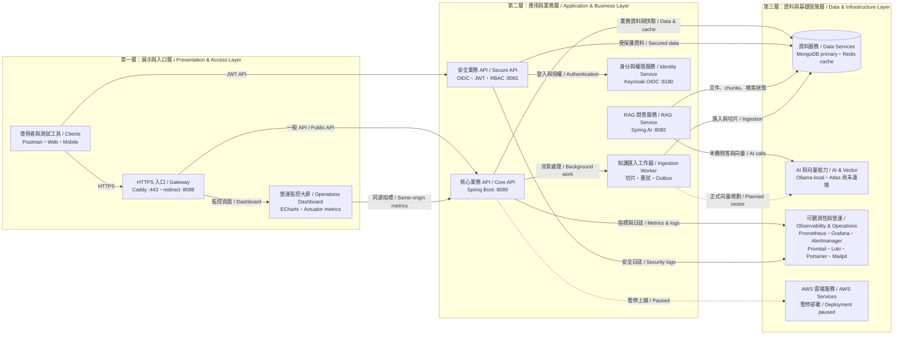

# NewIdeaCase Platform

**中文：** NewIdeaCase 是以 Java 21、Spring Boot 4.1.0、MongoDB 與 Redis 建構的模組化應用平台，涵蓋商品、使用者、訂單、OIDC/JWT 安全、監控、集中式日誌，以及 Spring AI/Ollama RAG。AWS 部署與 SDK 整合目前暫停，主要功能可透過 Docker Compose 在本機驗證。

**English:** NewIdeaCase is a modular Java 21 and Spring Boot 4.1.0 platform backed by MongoDB and Redis. It includes catalog, user profile, ordering, OIDC/JWT security, monitoring, centralized logging, and a Spring AI/Ollama RAG runtime. AWS deployment and SDK integration are intentionally paused, while the primary platform can be validated locally with Docker Compose.

## 系統架構 / Architecture



### 三層職責 / Layer Responsibilities

1. **展示與入口層 / Presentation & Access:** 接收使用者、Postman 與 Dashboard 請求，統一處理 HTTPS 入口與頁面呈現。
2. **應用與業務層 / Application & Business:** 執行商品、使用者、訂單、安全授權、RAG 問答及知識匯入流程。
3. **資料與基礎設施層 / Data & Infrastructure:** 提供 MongoDB、Redis、AI 模型、監控、日誌、告警與容器管理能力。

**圖例 / Reading guide:** 實線代表目前本機平台的主要資料流與服務依賴；虛線代表尚未接上的正式環境整合。AWS 維持暫停部署，MongoDB Atlas Vector Search 尚未連接。

完整的模組邊界、資料流、安全、RAG、可觀測性與部署決策請參閱 [ARCHITECTURE.md](ARCHITECTURE.md)。

See [ARCHITECTURE.md](ARCHITECTURE.md) for complete module boundaries, data flows, security, RAG, observability, and deployment decisions.

## Implemented

- `POST /api/v1/products` creates a product in MongoDB.
- `GET /api/v1/products/{id}` reads through the Redis cache.
- `GET /api/v1/products?limit=20&cursor=...` uses opaque cursor pagination ordered by newest first.
- `PATCH /api/v1/products/{id}` performs partial updates with optimistic locking through `version`.
- `POST /api/v1/knowledge/documents` stores idempotent plain-text RAG sources and queues reliable chunking.
- `GET /api/v1/knowledge/documents/{id}` returns ingestion metadata without exposing source content.
- RFC Problem Details validation, conflict, not-found, and service-unavailable responses.
- Correlation ID propagation through `X-Correlation-Id`.
- Optional OIDC/JWT resource server with issuer/audience validation and route-level scopes.
- Backend-only tenant and role resolution from JWT claims; knowledge documents and chunks carry ACL metadata.
- Cross-tenant or role-inaccessible knowledge documents return `404` without revealing existence.
- `POST /api/v1/rag/answers` uses tenant/role-filtered MongoDB chunks, local embeddings, vector retrieval, grounded generation, and source citations on the RAG app.
- `GET` and `PUT /api/v1/users/me` read and update the current JWT subject's profile.
- `POST /api/v1/orders`, `GET /api/v1/orders/{id}`, and `PATCH /api/v1/orders/{id}/status` implement owned orders, product snapshots, totals, state transitions, and optimistic locking.
- MongoDB replica set and Redis local Docker topology.
- Caddy local HTTPS, Keycloak OIDC, Mailpit SMTP, Alertmanager, Prometheus, Grafana, Loki, Promtail, and Portainer.
- Prometheus metrics, ingestion queue telemetry, alert rules, centralized application logs, and provisioned Grafana datasources/dashboard.
- AWS boundary document and `ObjectStoragePort`; no AWS SDK or live AWS connection.

## Run tests and build

```powershell
.\mvnw.cmd -Prag clean verify
```

## Run locally with Docker

Docker Desktop must be running.

```powershell
Copy-Item .env.example .env
docker compose up --build
```

Health: `http://localhost:8080/actuator/health`

Operations dashboard: `http://localhost:8080/dashboard/`

Prometheus: `http://localhost:9090`

Grafana: `http://localhost:3000` (local credentials come from `.env`; defaults are shown in `.env.example`)

Keycloak: `http://localhost:8180`

Mailpit: `http://localhost:8025`

Alertmanager: `http://localhost:9093`

Loki: `http://localhost:3100`

Portainer: `http://localhost:9000`

OpenAPI: `http://localhost:8080/swagger-ui.html`

Local RAG API: `http://localhost:8082` (requires the configured Ollama endpoint)

Create a product:

```powershell
$body = @{
  sku = 'SKU-001'
  name = 'Example product'
  description = 'First vertical slice'
  amount = 1299.00
  currency = 'TWD'
} | ConvertTo-Json

$product = Invoke-RestMethod -Method Post -Uri http://localhost:8080/api/v1/products `
  -ContentType application/json -Body $body
```

List products and follow the next cursor:

```powershell
$firstPage = Invoke-RestMethod -Uri 'http://localhost:8080/api/v1/products?limit=2'
$secondPage = Invoke-RestMethod -Uri `
  "http://localhost:8080/api/v1/products?limit=2&cursor=$($firstPage.nextCursor)"
```

Update a product with the version returned by create, get, or list:

```powershell
$update = @{
  name = 'Updated product'
  amount = 1399.00
  currency = 'TWD'
  version = $product.version
} | ConvertTo-Json

Invoke-RestMethod -Method Patch -Uri "http://localhost:8080/api/v1/products/$($product.id)" `
  -ContentType application/json -Body $update
```

The list limit must be between `1` and `100`. A malformed cursor returns `400`; an outdated product version returns `409`. JSON `null` means "leave unchanged"; use `clearDescription=true` to explicitly clear the product description. Supplying both `description` and `clearDescription=true` returns `400`.

Register a plain-text knowledge source:

```powershell
$documentBody = @{
  title = 'Return policy'
  mediaType = 'text/plain'
  content = 'Products may be returned within 30 days.'
} | ConvertTo-Json

$document = Invoke-RestMethod -Method Post `
  -Uri http://localhost:8080/api/v1/knowledge/documents `
  -ContentType application/json -Body $documentBody

Invoke-RestMethod -Uri `
  "http://localhost:8080/api/v1/knowledge/documents/$($document.id)"
```

Only `text/plain` content up to 100,000 UTF-8 bytes is accepted. The backend assigns the tenant and deduplicates retries by `(tenantId, SHA-256 checksum)`. Registration returns `PENDING`; the MongoDB outbox worker normalizes and splits the source into deterministic overlapping chunks, then changes the status to `CHUNKED`. The local RAG app embeds authorized chunks on demand in a Spring AI `SimpleVectorStore`; `CHUNKED` does not claim that a persistent Atlas vector index is ready.

Run the repeatable local acceptance suite after starting Compose:

```powershell
.\scripts\acceptance.ps1
.\scripts\monitoring-acceptance.ps1
.\scripts\platform-services-acceptance.ps1
.\scripts\rag-acceptance.ps1
```

The application exposes Prometheus data at `/actuator/prometheus`. The provisioned `NewIdeaCase Platform` dashboard shows availability, HTTP request rate, 5xx ratio, p95 latency, JVM heap, process CPU, ingestion outcomes, and pending/processing/failed queue depth. Alert rules cover application downtime, elevated 5xx responses, queue backlog, and terminal ingestion failures.

The responsive operations dashboard at `/dashboard/` reads the same-origin Actuator health and Prometheus endpoints every five seconds. ECharts animates HTTP throughput, latency, status distribution, endpoint ranking, JVM resources, thread counts, and knowledge-ingestion state without introducing a separate frontend build toolchain.

The Compose monitoring endpoints are for local development. In production, keep `/actuator/prometheus`, Prometheus, and Grafana on private networks and put Grafana behind organization authentication; do not expose them directly to the public Internet.

## Enable security

Set the following values and start with `APP_SECURITY_ENABLED=true`:

```text
OIDC_ISSUER_URI
OIDC_AUDIENCE
OIDC_TENANT_CLAIM=tenant_id
OIDC_ROLES_CLAIM=roles
APP_SECURITY_ENABLED=true
```

When security is enabled, the backend derives tenant and roles from the JWT. Clients cannot submit a tenant or an ACL filter. Route authorities are:

| Route | Authority |
|---|---|
| `GET /api/v1/products/**` | `SCOPE_catalog.read` |
| `POST /api/v1/products`, `PATCH /api/v1/products/**` | `SCOPE_catalog.write` |
| `GET /api/v1/knowledge/documents/**` | `SCOPE_knowledge.read` |
| `POST /api/v1/knowledge/documents` | `SCOPE_knowledge.write` |
| `POST /api/v1/rag/answers` | `SCOPE_knowledge.read` |
| `GET /api/v1/users/me` | `SCOPE_profile.read` |
| `PUT /api/v1/users/me` | `SCOPE_profile.write` |
| `GET /api/v1/orders/**` | `SCOPE_orders.read` |
| `POST /api/v1/orders`, `PATCH /api/v1/orders/**` | `SCOPE_orders.write` |

The default local app on port `8080` intentionally keeps security disabled and uses `app.knowledge.default-tenant-id`. The secure app on port `8081` validates tokens issued by the local Keycloak realm. Production must provide its own issuer, audience, and secret management.

## Local RAG

The Maven `rag` profile supplies Spring AI 2.0.0 Ollama, vector-store, MongoDB Atlas Vector Store, and Advisor dependencies:

```powershell
.\mvnw.cmd -Prag clean verify
```

The `app-rag` service on port `8082` enables the local adapter. It expects an Ollama endpoint reachable from Docker, with `qwen2.5:0.5b` and `nomic-embed-text` by default. Configure `OLLAMA_BASE_URL`, `RAG_CHAT_MODEL`, and `RAG_EMBEDDING_MODEL` in `.env` when using different endpoint or models. The default app on `8080` keeps RAG disabled and returns the explicit `503` contract.

Local retrieval rebuilds an in-memory `SimpleVectorStore` from at most 500 already-authorized MongoDB chunks per request. This is suitable for local acceptance, not the production scale path. The production adapter still requires an isolated MongoDB Atlas Vector Search environment, persistent embeddings, target-provider credentials, and golden-dataset evaluation. AWS ECR/ECS/EC2/ALB/S3/ElastiCache/CloudWatch/Secrets Manager remain outside the active Compose topology.

See [ARCHITECTURE.md](ARCHITECTURE.md), [docs/ACCEPTANCE.md](docs/ACCEPTANCE.md), and [docs/AWS-ADAPTER-PLAN.md](docs/AWS-ADAPTER-PLAN.md).
